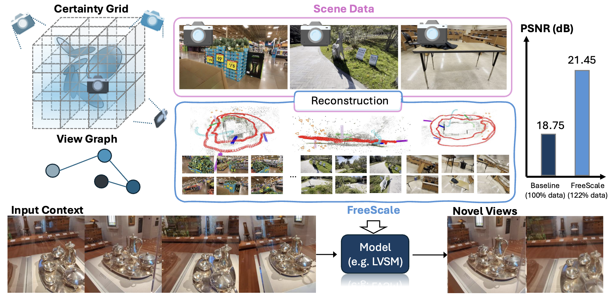

<br/>
<div align="center">
<h1 align="center"><strong>🌲 FreeScale</strong></h1>
<h3 align="center">Scaling 3D Scenes via Certainty-Aware Free-View Generation</h3>
  <p align="center">
    <strong>CVPR 2026</strong><br/>
    <a href='https://jiangchenhan.github.io' target='_blank'>Chenhan JIANG</a>&emsp;
    <a href='https://aibluefisher.github.io' target='_blank'>Yu CHEN</a>&emsp;
    <a href='https://kin-zhang.github.io' target='_blank'>Qingwen ZHANG</a>&emsp;
    <a href='https://scholar.google.com/citations?user=9a1PjCIAAAAJ&hl=en' target='_blank'>Jifei SONG</a>&emsp;
    <a>Songcen Xu</a>&emsp;
    <a href='https://sites.google.com/view/dyyeung' target='_blank'>Dit-Yan YEUNG</a>&emsp;
    <a href='https://jiankangdeng.github.io' target='_blank'>Jiankang DENG</a>
    <br/>
    <small>HKUST • NUS • KTH • University of Surrey • Imperial College London</small>
  </p>
</div>

<div align="center">
  <a href="https://arxiv.org/pdf/2604.10512">
    
  </a>
  <a href="https://mvp-ai-lab.github.io/FreeScale">
    
  </a>
  <a href="https://github.com/mvp-ai-lab/FreeScale">
    
  </a>
  <a href="https://github.com/mvp-ai-lab/FreeScale/blob/main/LICENSE">
    
  </a>
  <a href="https://huggingface.co/mvp-ai-lab/FreeScale">
    
  </a>
</div>

<br/>

## 📖 Abstract

<div align="justify">
  
  <br/><br/>
  The development of generalizable Novel View Synthesis (NVS) models is critically limited by the scarcity of large-scale training data featuring diverse and precise camera trajectories. While real-world captures are photorealistic, they are typically sparse and discrete. Conversely, synthetic data scales but suffers from a domain gap and often lacks realistic semantics. 
  <br/><br/>
  We introduce <strong>FreeScale</strong>, a novel framework that leverages the power of scene reconstruction to transform limited real-world image sequences into a scalable source of high-quality training data. Our key insight is that an imperfect reconstructed scene serves as a rich geometric proxy, but naively sampling from it amplifies artifacts. To this end, we propose a <strong>certainty-aware free-view sampling</strong> strategy identifying novel viewpoints that are both semantically meaningful and minimally affected by reconstruction errors. 
  <br/><br/>
  We demonstrate FreeScale's effectiveness by scaling up the training of feedforward NVS models, achieving a notable gain of <strong>2.7 dB in PSNR</strong> on challenging out-of-distribution benchmarks. Furthermore, we show that the generated data can actively enhance per-scene 3D Gaussian Splatting optimization, leading to consistent improvements across multiple datasets. Our work provides a practical and powerful data generation engine to overcome a fundamental bottleneck in 3D vision.
</div>

<br/>

## 📑 Table of Contents

<details open>
<summary><strong>Click to expand</strong></summary>
<br/>

1. [🚀 Getting Started](#-getting-started)
2. [🎨 Free-View Image Sampling](#-free-view-image-sampling)
3. [🔄 Enhance Downstream Tasks](#-enhance-downstream-tasks)
   - [Enhance LVSM Training](#enhance-lvsm-training)
   - [Enhance Per-Scene Reconstruction](#enhance-per-scene-reconstruction)
4. [📁 Data Format](#-data-format)
5. [🙏 Acknowledgements](#-acknowledgements)
6. [📝 Citation](#-citation)

</details>

<br/>

## 🚀 Getting Started

To set up **FreeScale**, follow the steps below:

### 1. Clone the repository and create conda environment

```bash
git clone https://github.com/mvp-ai-lab/FreeScale.git
cd FreeScale

conda create -n free_scale python=3.11
conda activate free_scale
```

### 2. Install PyTorch ≥ 2.5.0 with CUDA support

```bash
conda install pytorch torchvision torchaudio pytorch-cuda=12.8 -c pytorch -c nvidia
```

### 3. Install requirements

```bash
pip install -r requirements.txt

pip install git+https://github.com/facebookresearch/pytorch3d.git --no-build-isolation
pip install git+https://github.com/NVlabs/tiny-cuda-nn/#subdirectory=bindings/torch --no-build-isolation
pip install git+https://github.com/AIBluefisher/gsplat.git --no-build-isolation
pip install git+https://github.com/fraunhoferhhi/PLAS.git

cd gaussian_splatting/
pip install submodules/fused-ssim --no-build-isolation
pip install submodules/FasterGSCudaBackend
pip install submodules/MortonEncoding --no-build-isolation
cd ..
```

<br/>

## 🎨 Free-View Image Sampling

### Configuration

Please replace the following paths in `gaussian_splatting/configs/` with your own paths:

| Parameter | Description |
|-----------|-------------|
| `dataset.root_dir` | Path to your data directory |
| `dataset.output_dir` | Path for output results |
| `dataset.load_from` | Path to load pre-trained models |
| `dataset.sampler_dir` | Path for sampler data |

### Configuration Modes

We use different initialization geometries for different scenarios:

| Mode | Setting | Use Case |
|------|---------|----------|
| `custom_ff` | `dataset.val_interval=32` | Feedforward method (in-domain) |
| `custom` | `dataset.val_interval=0.3` | Per-scene reconstruction (OOD) |

### Commands

```bash
# Set your parameters
CONFIG_FILE="custom_ff"  # or "custom"
INIT_PLY_TYPE="sparse"   # or "dense"
SCENE="/path/to/your/scene"

cd FreeScale/gaussian_splatting/

# Step 1: Reconstruct scene geometry
python train.py --config config/$CONFIG_FILE.yaml \
                --init_ply_type $INIT_PLY_TYPE \
                --scene $SCENE
                # Optional: --suffix 3dgs

# Optional: Denoising (if needed)
# python denoise.py --config config/custom_fvg.yaml --start_index $START_ID

# Step 2: Evaluate reconstruction
python eval.py --config config/$CONFIG_FILE.yaml \
               --init_ply_type $INIT_PLY_TYPE \
               --scene $SCENE --val 1
               # Optional: --suffix 3dgs

# Step 3: Generate free-view images
python sample_trajs.py --config config/${CONFIG_FILE}_fvg.yaml \
                       --init_ply_type $INIT_PLY_TYPE \
                       --scene $SCENE
                       # Optional: --scene_list_file scene_list.txt
                       # Optional: --suffix 3dgs
```

<br/>

## 🔄 Enhance Downstream Tasks

### Enhance LVSM Training

**Step 1: Convert camera format**

```bash
cd FreeScale/gaussian_splatting/
python prepare_camera_as_json.py
```

> 💡 **Note**: Replace `"root"` with your `output_dir` from `configs/custom_ff_fvg.yaml`

**Step 2: Train and evaluate**

The evaluation index can be found in `FreeScale/lvsm/data/`.

```bash
# Training
bash FreeScale/scripts/train_lvsm.sh

# Evaluation
bash FreeScale/lvsm/test.sh
```

### Enhance Per-Scene Reconstruction

```bash
cd FreeScale/gaussian_splatting/

# Single scene training
python train.py --config config/custom_fvg.yaml \
                --init_ply_type $INIT_PLY_TYPE \
                --scene $SCENE
                # Optional: --suffix 3dgs

# Batch processing
bash FreeScale/scripts/freeview_sampling.sh
```

<br/>

## 📁 Data Format

The data should be organized in the following structure:

```
DATA_DIR/
└── {SCENE_ID}/
    ├── sparse/
    │   └── 0/
    │       ├── cameras.bin
    │       ├── database.db
    │       └── ...
    ├── images/
    │   ├── {image_name}_000001.png
    │   ├── {image_name}_000002.png
    │   ├── ...
    │   ├── {image_name}_000200.png
    │   ├── {image_name}_000201.png
    │   └── ...
    └── depths/
        ├── {image_name}_000001.png
        └── ...
```

<br/>

## 🙏 Acknowledgements

Our code is built on top of the following excellent codebases:

- [DOGS](https://github.com/AIBluefisher/DOGS)
- [RayZer](https://github.com/hwjiang1510/RayZer)

We thank the authors for their open-source contributions.

<br/>

## 📝 Citation

If you find this work useful for your research, please consider citing:

```bibtex
@inproceedings{jiang2026freescale,
  title={FreeScale: Scaling 3D Scenes via Certainty-Aware Free-View Generation},
  author={Jiang, Chenhan and Chen, Yu and Zhang, Qingwen and Song, Jifei and Xu, Songcen and Yeung, Dit-Yan and Deng, Jiankang},
  booktitle={Proceedings of the IEEE/CVF Conference on Computer Vision and Pattern Recognition (CVPR)},
  year={2026}
}
```
